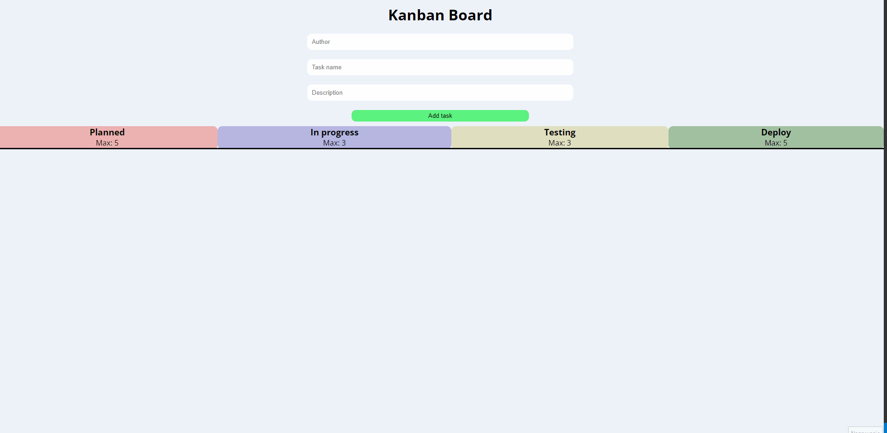

# Kanban Board

## Overview 🔍



The aim of the project was to practice modern React usage focusing on **functional components, hooks, and context.** The project is a kanban-based tool to make a visualization of workflow. It also allows us to track the tasks.

### Features:

- **Creating new tasks via validated form**
- **Task management:**
    - **moving tasks between tables**
    - **tasks are saved in localStorage**  
    - **tasks are updated in localStorage during moving right or left** 
    - **delete tasks**


## Built with 🔧


## Installation and configuration 💾

The project uses [node](https://nodejs.org/en/) and [npm](https://www.npmjs.com/), follow the steps below to be able to use the application.

- Install all npm packages using command:
````
npm i
````

- To start develope mode use command:

````
npm start
````


## Author 🔥
* Linkedin - [AndrejKaczanowski](https://www.linkedin.com/in/andrej-kaczanowski-frontend/).

## Special thanks 🙏🏻
Thanks to my [Mentor - devmentor.pl](https://devmentor.pl/) - for providing me with this task and for code review.
